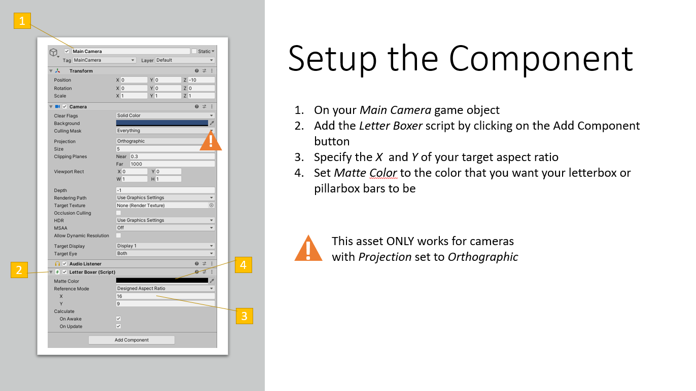
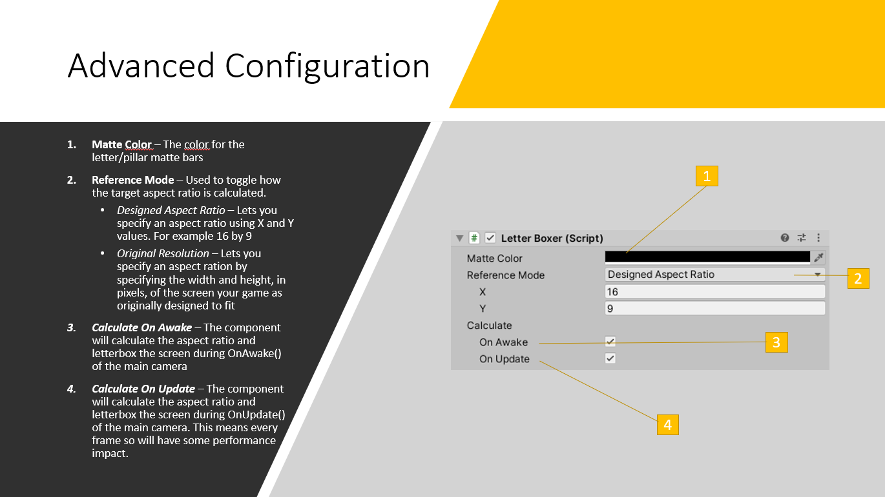

# Letter Boxer

* Preserve your 2D game's aspect ratio with no effort
* Works with any orthographic camera
* Works on mobile devices
* Works with Unity UI canvas
* Include's "Shooting Gallery" mini-game example

**Download lastest Unity package from [releases](https://github.com/rabidgremlin/LetterBoxer/releases)**

